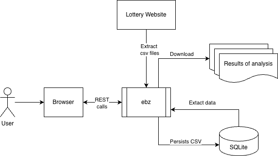
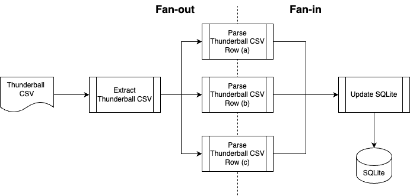

# Architecture

## Runtime Architecture

This is the runtime architecture of `ebz`:

Operational flow:

- User download csv files from national lottery website.
- Operations via Frontend
  - User starts `ebz`, it checks to verify `$HOME/.ebz/lottery.db` exists.
  - `ebz`presents user with a dashboard.
  - User upload csv file via the dashboard.
- Upload csv via cli
  - User starts `ebz --file <csv file>`, it checks to verify `$HOME/.ebz/lottery.db` exists.

## Tech Stack

- **Backend Logic:** Go 1.24+ using standard library.
- **Backend CLI:** `github.com/spf13/cobra` and `github.com/spf13/viper`.
- **Database:** SQLite (via `modernc.org/sqlite`).
- **Frontend:** Web UI powered by JavaScript, ReactJS and Material UI no Typescript.

## Code Structure

- `/cmd/ebz/`: Primary Go application entry point.
- `/internal/ebzconfig`: Go package to support configuration operations.
- `/internal/csvops`: Go package of operations to read and process CSV files.
- `/internal/ebzcli`: Go package to support backend cli commands and flags operations.
- `/internal/ebzweb`: Go package to support the delivery of Frontend.
- `/internal/euro`: Shared Go package to support analysis of past EuroMillions results.
- `/internal/lotto`: Shared Go package to support analysis of past Lotto results.
- `/internal/sflife`: Shared Go package to support analysis of past Set For Life results.
- `/internal/sqlops`: Go package containing common SQL operations.
- `/internal/tball`: Shared Go package to support analysis of past Thunderball results.
- `/web`: Folder containing JavaScript, ReactJS and Material UI.

## CSV Processing Architecture

The processing of CSV data from the National Lottery involves a fan-out-fan-in pattern to improve performance by parsing records in parallel:

1. **Fan-out:** The `ProcessCSV` function in each game-specific package (`tball`, `euro`, etc.) spawns a pool of worker goroutines.
2. **Parallel Processing:** Each worker reads a `CSVRec` from the shared channel and parses it into a game-specific `Draw` structure.
3. **Fan-in:** The results are sent to a shared result channel, which is then collected into a slice and returned.

## Build Architecture

### Build Frontend

1. The result of Web build that includes `index.html` and `bundle.js` will be stored in Go package `/internal/ebzweb/public`.
2. The result of Web build is embedded as part of built application.

### `ebz` Application Build

1. `ebz` application is a single static binary application.
2. Web frontend is embedded in `ebz` binary.
3. The build process uses Docker to create binaries in `./package/`.
4. `./scripts/ebz.sh` is use to trigger the build process.
