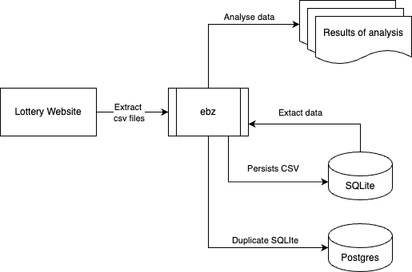

# Architecture

## Runtime Architecture

This is the runtime architecture of `ebz`:

Operational flow:

- User start `ebz` and is presented with a dashboard via Browser.
- User download draw csv files from national lottery website.
- User upload csv file via frontend or via cli.

## Tech Stack

- **Backend Logic:** Go 1.24+ using standard library.
- **Backend CLI:** `github.com/spf13/cobra` and `github.com/spf13/viper`.
- **Database:** SQLite (via `modernc.org/sqlite`).
- **Frontend:** Web UI powered by JavaScript, ReactJS and Material UI no Typescript.

## Code Structure

- `/cmd/ebz/`: Primary Go application entry point.
- `/internal/config`: Go package to support configuration operations.
- `/internal/csvops`: Go package of operations to read and process CSV files.
- `/internal/ebzcli`: Go package to support backend cli commands and flags operations.
- `/internal/ebzweb`: Go package to support the delivery of Frontend.
- `/internal/sqlops`: Go package containing common SQL operations.
- `/internal/tball`: Shared Go package to support analysis of past Thunderball results.
- `/web`: Folder containing JavaScript, ReactJS and Material UI.

## Build Architecture

### Build Frontend

1. The result of Web build that includes `index.html` and `bundle.js` will be stored in Go package `/internal/ebzweb/public`.
2. The result of Web build is embedded as part of built application.

### `ebz` Application Build

1. `ebz` application is a single static binary application.
2. Web frontend is embedded in `ebz` binary.
3. The build process uses Docker to create binaries in `./package/`.
4. `./scripts/ebz.sh` is use to trigger the build process.
