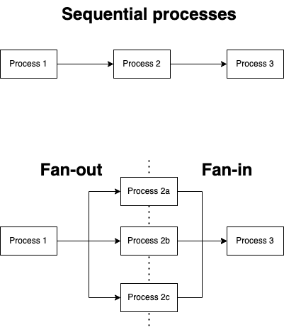

# Fan In and Fan Out Pattern

The fan-out and fan-in concurrency pattern is a way to exploit aspects of a sequential process that can be made concurrent (see Figure 1).


<figcaption>Figure 1 - The fan-out and fan-in pattern</figcaption>

In this project, you will find a number of Fan-out pattern.

* [Example 1 - Persisting CSV File](#persisting-csv-file)
* [Example 2 - Using worker pool](#with-worker-pool)

## Persisting CSV File

In this case CSV file from the lottery site is process in two steps:

1) Extract csv items
2) Persists in SQLite DB

A sequential process would involve collecting rows and aggregating it into a data slice. Once the slice is collected to then range over the slice and persists the items to SQLIte.

In fan-out pattern implemented, when each row in csv file is extracted, it is immediately sent via Go channel to a multiple concurrent function to persists data.

```go
func processCSV(ctx context.Context, r io.Reader) <-chan DrawChan {
	c := make(chan DrawChan)
	go func() {
		cr := csv.NewReader(r)
		cr.Read() // remove titles
		ln := 1
		defer close(c)

	loop:
		for {
			select {
			case <-ctx.Done():
				break loop
			default:
				ln++
				rec, err := cr.Read()
				if errors.Is(err, io.EOF) {
					break loop
				}
				if err != nil {
					c <- DrawChan{
						Draw: Draw{},
						Err:  err,
					}
					continue loop
				}
				drawDate, err := csvutil.ParseDateTime(rec[0])
				if err != nil {
					c <- DrawChan{
						Draw: Draw{},
						Err:  fmt.Errorf("record on line: %d: %w", ln, err),
					}
					continue loop
				}
				b1, err := csvutil.ParseDrawNum(rec[1], 50)
				if err != nil {
					c <- DrawChan{
						Draw: Draw{},
						Err:  fmt.Errorf("record on line: %d: %w", ln, err),
					}
					continue loop
				}
				b2, err := csvutil.ParseDrawNum(rec[2], 50)
				if err != nil {
					c <- DrawChan{
						Draw: Draw{},
						Err:  fmt.Errorf("record on line: %d: %w", ln, err),
					}
					continue loop
				}
				b3, err := csvutil.ParseDrawNum(rec[3], 50)
				if err != nil {
					c <- DrawChan{
						Draw: Draw{},
						Err:  fmt.Errorf("record on line: %d: %w", ln, err),
					}
					continue loop
				}
				b4, err := csvutil.ParseDrawNum(rec[4], 50)
				if err != nil {
					c <- DrawChan{
						Draw: Draw{},
						Err:  fmt.Errorf("record on line: %d: %w", ln, err),
					}
					continue loop
				}
				b5, err := csvutil.ParseDrawNum(rec[5], 50)
				if err != nil {
					c <- DrawChan{
						Draw: Draw{},
						Err:  fmt.Errorf("record on line: %d: %w", ln, err),
					}
					continue loop
				}
				ls1, err := csvutil.ParseDrawNum(rec[6], 12)
				if err != nil {
					c <- DrawChan{
						Draw: Draw{},
						Err:  fmt.Errorf("record on line: %d: %w", ln, err),
					}
					continue loop
				}
				ls2, err := csvutil.ParseDrawNum(rec[7], 12)
				if err != nil {
					c <- DrawChan{
						Draw: Draw{},
						Err:  fmt.Errorf("record on line: %d: %w", ln, err),
					}
					continue loop
				}
				dn, err := csvutil.ParseDrawSeq(rec[9])
				if err != nil {
					c <- DrawChan{
						Draw: Draw{},
						Err:  fmt.Errorf("record on line: %d: %w", ln, err),
					}
					continue loop
				}
                // Every row is immediately sent to Go channel
				c <- DrawChan{
					Draw: Draw{
						DrawDate:  drawDate,
						DayOfWeek: drawDate.Weekday(),
						Ball1:     uint8(b1),
						Ball2:     uint8(b2),
						Ball3:     uint8(b3),
						Ball4:     uint8(b4),
						Ball5:     uint8(b5),
						LS1:       uint8(ls1),
						LS2:       uint8(ls2),
						UKMarker:  rec[8],
						DrawNo:    dn,
					},
					Err: nil,
				}
			}
		}
	}()
	return c
}

func persistsCSV(ctx context.Context, sqlite *sql.DB, nworkers int) error {
	r, err := csvutil.DownloadFrom(CSVUrl)
	if err != nil {
		return err
	}
	ch := processCSV(ctx, r)

    // Multiple persistsDraw function is called
	var wg sync.WaitGroup
	wg.Add(nworkers)
	for i := 0; i < nworkers; i++ {
		go func() {
			defer wg.Done()
            // The function takes Go channel, so when a piece of data
            // arrives it is processes.
			err := persistsDraw(ctx, sqlite, ch)
			if err != nil {
				log.Println(err)
			}

		}()
	}
	wg.Wait()
	return nil
}
```

## With Worker Pool

We have a scenario where we need to determined the frequency of a combination of two numbers from a range of numbers and comparing it to the historical draws.

The implementation to fulfil this operation is as follows:

```go
type TwoCombo struct {
	Combo [2]uint8
	Count uint
}

// Worker
func twoMainComboFreqWorker(ctx context.Context, stmt *sql.Stmt, input <-chan [2]uint8, result chan<- TwoCombo) {
	for i := range input {
		tc := TwoCombo{}
		count, err := countTwoMain(ctx, stmt, i[0], i[1])
		if err != nil {
			continue
		}
		tc.Combo = i
		tc.Count = count
		result <- tc
	}
}

func twoMainComboFreq(ctx context.Context, stmt *sql.Stmt, numworkers int) []TwoCombo {

	numOfJob := 1081
	set := []uint8{
		1, 2, 3, 4, 5, 6, 7, 8, 9, 10,
		11, 12, 13, 14, 15, 16, 17, 18, 19, 20,
		21, 22, 23, 24, 25, 26, 27, 28, 29, 30,
		31, 32, 33, 34, 35, 36, 37, 38, 39, 40,
		41, 42, 43, 44, 45, 46, 47,
	}

	jobs := make(chan [2]uint8, numOfJob)
	output := make(chan TwoCombo, numOfJob)

    // Multiple workers
	for i := 0; i < numworkers; i++ {
		go twoMainComboFreqWorker(ctx, stmt, jobs, output)
	}

    // Create job
	for i := 0; i < len(set); i++ {
		for j := i + 1; j < len(set); j++ {
			d := [2]uint8{}
			d[0], d[1] = set[i], set[j]
			jobs <- d
		}
	}

	results := []TwoCombo{}
	for i := 0; i < numOfJob; i++ {
        // Collect jobs and consolidate result
		results = append(results, <-output)
	}
	return results
}
```