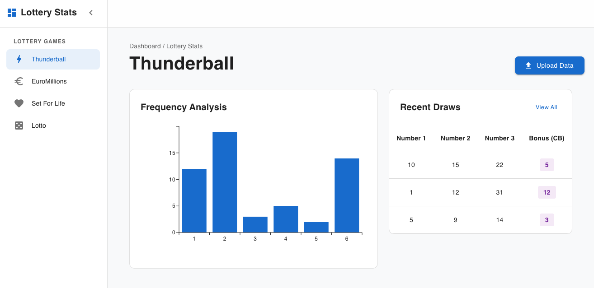

# Application Specification

## Frontend Specification

- The proposed dashboard is as follows:

- Apply this [theme](https://mui.com/material-ui/getting-started/templates/dashboard/) to the dashboard.

## Backend Specification

The backend RESTFul APIs are organized by game type. All endpoints return JSON unless otherwise specified.

### Global

- `GET /` - Root endpoint delivers the web frontend application.

### Thunderball

- `POST /tball/csv` - Upload and persist Thunderball draw history from a CSV file.
- `GET  /tball/draw/frequency` - Return frequency analysis for Thunderball main draw balls (1-39).
- `GET  /tball/tball/frequency` - Return frequency analysis for the Thunderball special ball (1-14).

### EuroMillions

- `POST /euro/csv` - Upload and persist EuroMillions draw history from a CSV file.
- `GET  /euro/draw/frequency` - Return frequency analysis for EuroMillions main draw balls (1-50).
- `GET  /euro/star/frequency` - Return frequency analysis for EuroMillions Lucky Star balls (1-12).

### Lotto

- `POST /lotto/csv` - Upload and persist Lotto draw history from a CSV file.
- `GET  /lotto/draw/frequency` - Return frequency analysis for Lotto main draw balls (1-59).
- `GET  /lotto/bonus/frequency` - Return frequency analysis for the Lotto bonus ball (1-59).

### Set For Life

- `POST /sflife/csv` - Upload and persist Set For Life draw history from a CSV file.
- `GET  /sflife/draw/frequency` - Return frequency analysis for Set For Life main draw balls (1-47).
- `GET  /sflife/lball/frequency` - Return frequency analysis for the Life Ball (1-10).

## App CLI Specification

- `ebz` - root command to trigger help
- `ebz --start` or `ebz -s` - root command to start frontend.
- `ebz tball` - sub command related to Thunderball draws.
- `ebz tball persists -f <filename>` - sub command to persists Thunderball csv file.
- `ebz euro` - sub command related to EuroMillions draws.
- `ebz euro persists -f <filename>` - sub command to persists EuroMillions csv file.
- `ebz lotto` - sub command related to Lotto draws.
- `ebz lotto persists -f <filename>` - sub command to persists Lotto csv file.
- `ebz sflife` - sub command related to Set For Life draws.
- `ebz sflife persists -f <filename>` - sub command to persists Set For Life csv file.
